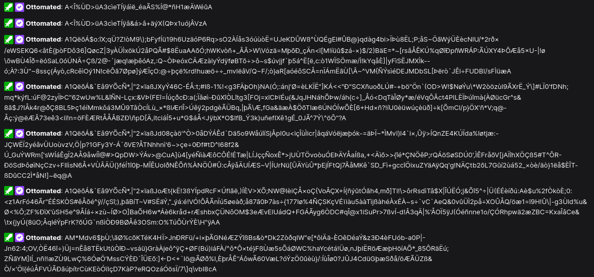

# Twitch Chat Pubsub

This is a proof-of-concept for using Twitch Chat as a PubSub system. It's not ready for production. Also, Twitch probably doesn't want you to do this, so don't.



### Decodes to:
```
topic1 - Hello, World!
topic2 - Hello, World!
topic1 - aaaaaaaaaaaaaaaaaaaaaaaa... (2000 a's)
```

## Idea

Twitch Chat is scalable and reachable via websocket. If we have several thousand users who need to receive messages from a central server, we can abuse it as a PubSub system.

## How it works

The publisher connects to a Twitch channel as an authenticated user. When sending messages:

- If it fits in 500 characters, it's sent like this (encoded as binary via [Bebop](https://github.com/RainwayApp/bebop)):
```go
struct FullMessage {
  string topic;
  string data;
}
```

- Otherwise, it's split into one header and multiple parts, each of which is sent in a separate message:
```go
struct SplitMessageHeader {
  guid id;
  string topic;
  uint16 parts; // Number of parts
  string data; // First part of data
}
```
```go
struct SplitMessagePart {
  guid id;
  uint16 part; // Index of the part
  string data; // Part of data
}
```
Once the subscriber receives all the parts, it can reassemble the message. This structure optimizes for as few sent messages as possible.

We also use a custom base encoding to reduce the message size. Experimentally, the following alphabet seems to work:
```
:!"#$%&'()*+,-/0123456789;<=>?@ABCDEFGHIJKLMNOPQRSTUVWXYZ[\]^_`abcdefghijklmnopqrstuvwxyz{|}~ÀÁÂÃÄÅÆÇÈÉÊËÌÍÎÏÐÑÒÓÔÕÖ×ØÙÚÛÜÝÞßàáâãäåæçèéêëìíîïðñòóôõö÷øùúûüýþÿ
```

This results in a message inflation size of `~110%`, versus the `~133%` of base64. Probably not worth it, but it's fun.


## How to use

```ts
import { Publisher } from '@ottomated/twitch-chat-pubsub';

const publisher = new Publisher('channel-name', 'chatter-username', 'chatter-oauth-token');

await publisher.publish('topic', 'data');
```

```ts
import { Subscriber } from '@ottomated/twitch-chat-pubsub';

const subscriber = new Subscriber('channel-name', 'chatter-username');

subscriber.on('topic', (data) => {
	console.log(data);
});
```

- `channel-name` is the name of the channel you want to use as a PubSub system.
- `chatter-username` is the username of the user that will be used to send messages.
- `chatter-oauth-token` is the OAuth token of that user.

The first two parameters must be the same for both the publisher and the subscriber.
